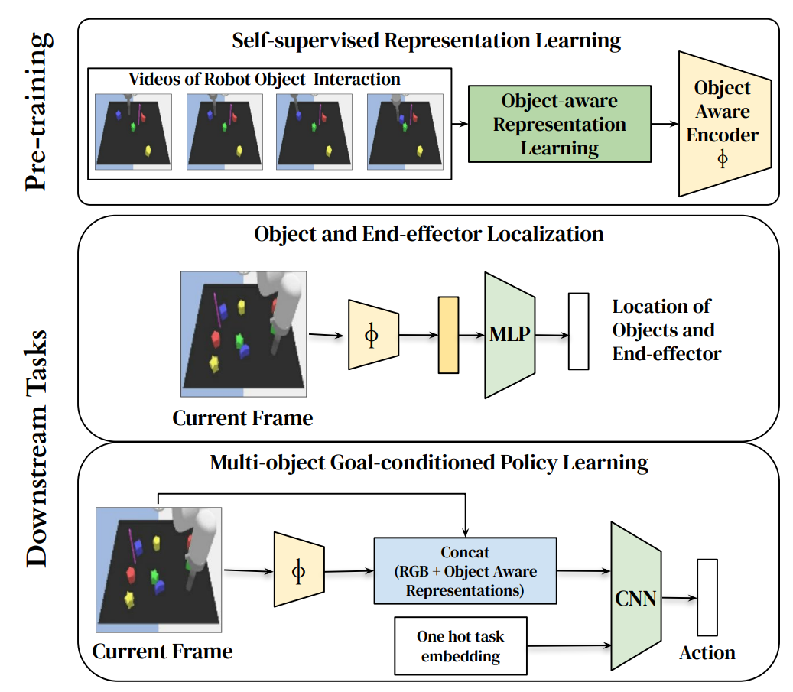
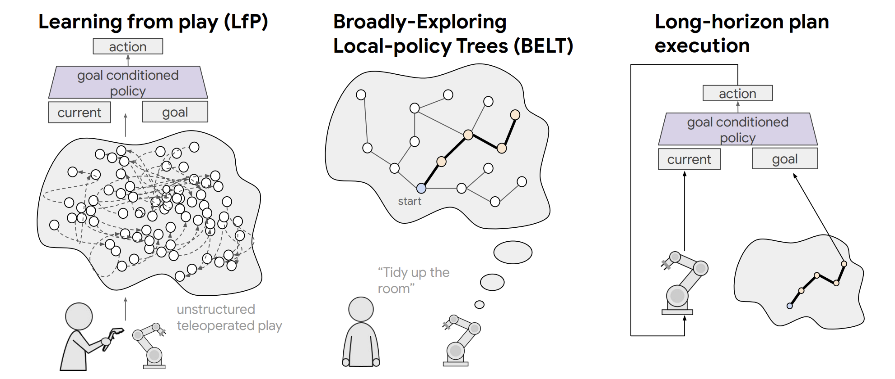
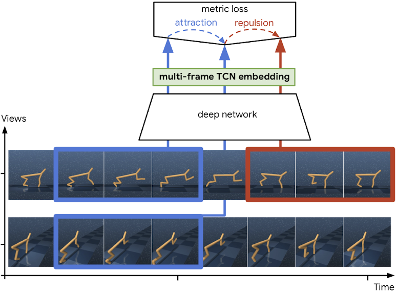

 <h2>Projects</h2>
<table valign="top">
  <!-- project block -->
  <tr>
    <td class="project-fig">
<video class="b-lazy" data-src="assets/interactive/realtime_30.mp4"
        type="video/mp4" autoplay muted playsinline loop style="display: block; width:100%;"></video>
</td>
    <td class="project-cell">
      
Interactive Language: Talking to Robots in Real Time

      <dt-byline>

      <a class="project-link" href=https://interactive-language.github.io/>Project Page</a>
      <a class="project-link" href=https://arxiv.org/abs/2210.06407>Paper</a>
      <a class="project-link" href=https://github.com/google-research/language-table#datasets>Language-Table Dataset</a>
      <a class="project-link" href=https://github.com/google-research/language-table>Code</a>
      <a class="project-link" href=https://ai.googleblog.com/2022/12/talking-to-robots-in-real-time.html>Blogpost</a>
      

 
      <u>Corey Lynch</u>, Ayzaan Wahid, Jonathan Tompson, Tianli Ding, James Betker, Robert Baruch, Travis Armstrong, Pete Florence. <em>In submission</em>.
    </td>
  </tr>
  <!-- project block -->
  <tr>
    <td class="project-fig">
<video class="b-lazy" data-src="assets/goalseye/goalseye.mp4"
        type="video/mp4" autoplay muted playsinline loop style="display: block; width:100%;"></video>
</td>
    <td class="project-cell">
      
GoalsEye: Learning High Speed Precision Table Tennis on a Physical Robot

      <dt-byline>

      <a class="project-link" href=https://sites.google.com/corp/view/goals-eye/>Project Page</a>
      <a class="project-link" href=https://arxiv.org/abs/2210.03662>Paper</a>
      <a class="project-link" href=https://ai.googleblog.com/2022/10/table-tennis-research-platform-for.html>Blogpost</a>
      

 
      Tianli Ding, Laura Graesser, Saminda Abeyruwan, David B. D'Ambrosio, Anish Shankar, Pierre Sermanet, Pannag R. Sanketi, <u>Corey Lynch</u>. <em>IROS 2022</em>.
    </td>
  </tr>
  <!-- project block -->
  <tr>
    <td class="project-fig">

</td>
    <td class="project-cell">
      
Visuomotor Control in Multi-Object Scenes Using Object-Aware Representations

      <dt-byline>

      <a class="project-link" href=https://arxiv.org/abs/2205.06333>Paper</a>
      

 
      Negin Heravi, Ayzaan Wahid, <u>Corey Lynch</u>, Pete Florence, Travis Armstrong, Jonathan Tompson, Pierre Sermanet, Jeannette Bohg, Debidatta Dwibedi. <em>In submission</em>.
    </td>
  </tr>
  <!-- project block -->
  <tr>
    <td class="project-fig">
<video class="b-lazy" data-src="assets/ibc/insertion-small.mp4"
        type="video/mp4" autoplay muted playsinline loop style="display: block; width:100%;"></video>
</td>
    <td class="project-cell">
      
Implicit Behavioral Cloning

      <dt-byline>

      <a class="project-link" href=https://implicitbc.github.io/>Project Page</a>
      <a class="project-link" href=https://arxiv.org/abs/2109.00137>Paper</a>
      <a class="project-link" href=https://github.com/google-research/ibc>Code</a>
      <a class="project-link" href=https://ai.googleblog.com/2021/11/decisiveness-in-imitation-learning-for.html>Blogpost</a>
      

 
      Pete Florence, <u>Corey Lynch</u>, Andy Zeng, Oscar Ramirez, Ayzaan Wahid, Laura Downs, Adrian Wong, Johnny Lee, Igor Mordatch, Jonathan Tompson. <em>CORL 2021</em>.
    </td>
  </tr>
  <!-- project block -->
  <tr>
    <td class="project-fig">
<video class="b-lazy" data-src="assets/dbap/DBAP_final.mp4"
        type="video/mp4" autoplay muted playsinline loop style="display: block; width:100%;"></video>
</td>
    <td class="project-cell">
      
Demonstration-Bootstrapped Autonomous Practicing via Multi-Task Reinforcement Learning

      <dt-byline>

      <a class="project-link" href=https://dbap-rl.github.io//>Project Page</a>
      <a class="project-link" href=https://arxiv.org/abs/2203.15755>Paper</a>
      

 
      Abhishek Gupta, <u>Corey Lynch</u>, Brandon Kinman, Garrett Peake, Sergey Levine, Karol Hausman. <em>In submission</em>.
    </td>
  </tr>
  <!-- project block -->
  <tr>
    <td class="project-fig">

</td>
    <td class="project-cell">
      
Broadly-Exploring, Local-Policy Trees for Long-Horizon Task Planning

      <dt-byline>

      <a class="project-link" href=https://arxiv.org/abs/2010.06491>Paper</a>
      

 
      Brian Ichter, Pierre Sermanet, <u>Corey Lynch</u>. <em>CORL 2021</em>.
    </td>
  </tr>
  <!-- project block -->
  <tr>
    <td class="project-fig">
<video class="b-lazy" data-src="assets/bcz/bcz.mp4"
        type="video/mp4" autoplay muted playsinline loop style="display: block; width:100%;"></video>
</td>
    <td class="project-cell">
      
BC-Z: Zero-Shot Task Generalization with Robotic Imitation Learning

      <dt-byline>

      <a class="project-link" href=https://sites.google.com/corp/view/bc-z/home/>Project Page</a>
      <a class="project-link" href=https://arxiv.org/abs/2202.02005>Paper</a>
      <a class="project-link" href=https://github.com/google-research/tensor2robot/tree/master/research/bcz>Code</a>
      <a class="project-link" href=https://www.kaggle.com/datasets/google/bc-z-robot>Dataset</a>
      <a class="project-link" href=https://ai.googleblog.com/2022/02/can-robots-follow-instructions-for-new.html>Blogpost</a>
      

 
      Eric Jang, Alex Irpan, Mohi Khansari, Daniel Kappler, Frederik Ebert, <u>Corey Lynch</u>, Sergey Levine, Chelsea Finn. <em>CORL 2021</em>.
    </td>
  </tr>
  <!-- project block -->
  <tr>
    <td class="project-fig">
<video class="b-lazy" data-src="assets/langlfp/playlang_20200326-193259_13tasks_bt300k.mp4"
        type="video/mp4" autoplay muted playsinline loop style="display: block; width:100%;"></video>
</td>
    <td class="project-cell">
      
Language Conditioned Imitation Learning over Unstructured Data

      <dt-byline>

      <a class="project-link" href=https://language-play.github.io>Project Page</a>
      <a class="project-link" href=https://arxiv.org/abs/2005.07648>Paper</a>
      

 
      <u>Corey Lynch</u> and Pierre Sermanet, <em>RSS 2021</em>.
    </td>
  </tr>
  <!-- project block -->
  <tr>
    <td class="project-fig">
<video class="b-lazy" data-src="assets/relay/successtasks_RPL.mp4"
        type="video/mp4" autoplay muted playsinline loop style="display: block; width:100%;"></video>
</td>
    <td class="project-cell">
      
Relay Policy Learning: Solving Long-Horizon Tasks via Imitation and Reinforcement Learning

      <dt-byline>

      <a class="project-link" href=https://relay-policy-learning.github.io>Project Page</a>
      <a class="project-link" href=https://arxiv.org/abs/1910.11956>Paper</a>
      <a class="project-link" href=https://github.com/google-research/relay-policy-learning>Code</a>
      

 
      Abhishek Gupta, Vikash Kumar, <u>Corey Lynch</u>, Sergey Levine, Karol Hausman. <em>CORL 2019, oral presentation</em>.
    </td>
  </tr>
  <!-- project block -->
  <tr>
    <td class="project-fig">
<video class="b-lazy" data-src="assets/lmp/mp4/8tasks_cropped_640x180.mp4"
        type="video/mp4" autoplay muted playsinline loop style="display: block; width:100%;"></video>
</td>
    <td class="project-cell">
      
Learning Latent Plans from Play

      <dt-byline>

      <a class="project-link" href=https://learning-from-play.github.io>Project Page</a>
      <a class="project-link" href=https://arxiv.org/pdf/1903.01973.pdf>Paper</a>
      

 
      <u>Corey Lynch</u>, Mohi Khansari, Ted Xiao, Vikash Kumar, Jonathan Tompson, Sergey Levine, Pierre Sermanet. <em>CoRL 2019, oral presentation</em>.
    </td>
  </tr>
  <!-- project block -->
  <tr>
    <td class="project-fig">

      <video class="b-lazy" data-src="assets/mftcn/cheetah.mp4"
        type="video/mp4" autoplay muted playsinline loop style="display: block; width: 90%;"></video>
      
    
</td>
    <td class="project-cell">
      
Self-Supervised Actionable Representations

      <dt-byline>

      <a class="project-link" href=https://sites.google.com/view/actionablerepresentations/>Project Page</a>
      <a class="project-link" href=https://arxiv.org/abs/1808.00928>Paper</a>
      

 
      Debidatta Dwibedi, Jonathan Tompson, <u>Corey Lynch</u>, Pierre Sermanet. <em>IROS 2018</em>.
    </td>
  </tr>
  <!-- project block -->
  <tr>
    <td class="project-fig">

      <video class="b-lazy" data-src="assets/tcn/kuka_pouring_cropped960x540.mp4"
        type="video/mp4" autoplay muted playsinline loop style="display: block; width: 100%;"></video>
         
      <video class="b-lazy" data-src="assets/tcn/pose_all_cropped960x540.mp4"
        type="video/mp4" autoplay muted playsinline loop style="display: block; width: 100%;"></video>
    
</td>
    <td class="project-cell">
      
Time-Contrastive Networks (TCN)

      <dt-byline>

      <a class="project-link" href=https://sermanet.github.io/imitate>Project Page</a>
      <a class="project-link" href=https://arxiv.org/abs/1704.06888>Paper</a>
      <a class="project-link" href=https://www.youtube.com/watch?v=b1UTUQpxPSY>Video</a>
      <a class="project-link" href=https://sites.google.com/site/brainrobotdata/home/multiview-pouring>Dataset</a>
      <a class="project-link" href=https://github.com/tensorflow/models/tree/master/research/tcn>Code</a>
      <a class="project-link" href=https://docs.google.com/presentation/d/1EvWSbsFfnceBpN7yG1wnqM2LxySQ0Gi-wTx6QaoVekY/edit?usp=sharing>Slides</a>
      <a class="project-link" href=https://ai.googleblog.com/2017/07/teaching-robots-to-understand-semantic.html>Blogpost</a>
      

 
      Pierre Sermanet*, <u>Corey Lynch*</u>, Yevgen Chebotar*, Jasmine Hsu, Eric Jang, Stefan Schaal, Sergey Levine. <em>ICRA 2018</em>.
    </td>
  </tr>
  <!-- <tr> -->
  <!--   <td class="project-fig">
<video class="b-lazy" data-src="assets/" -->
  <!--       type="video/mp4" autoplay muted playsinline loop style="display: block; width: 100%;"></video>
</td> -->
  <!--   <td class="project-cell"> -->
  <!--     

 -->
  <!--     <dt-byline>
 -->
  <!--     <a class="project-link" href=>Project Page</a> -->
  <!--     <a class="project-link" href=>Paper</a> -->
  <!--     <a class="project-link" href=https://github.com/sermanet/sermanet.github.io/blob/master/assets/bib/>BibTex</a> -->
  <!--     <a class="project-link" href=>Video</a> -->
  <!--     <a class="project-link" href=>Slides</a> -->
  <!--     

  -->
  <!--        -->
  <!--     Description. -->
  <!--   </td> -->
  <!-- </tr> -->
</table>

<h2>Patents</h2>

 <u>Corey Lynch</u>, Pierre Sermanet, Seyed Mohammad Khansari Zadeh. Controlling Agents Using Latent Plans, <a class="project-link" href=https://patents.google.com/patent/US20220076099A1>U.S. Patent No. US20220076099A1</a> (2019)

